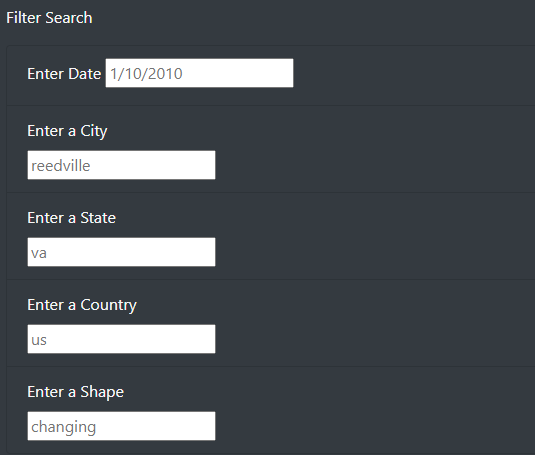
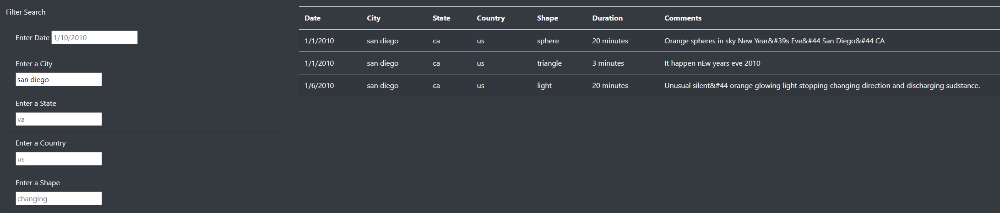
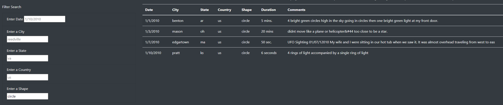
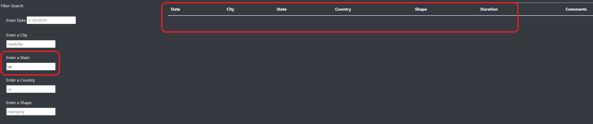

# UFO Sightings with Javascript

## Project Overview
In this project, we assisted Dana, a data journalist who was tasked with writing an article on a topic of her choice. Dana decided to write about her hometown of McMinnville, Oregon, famous for UFO sightings and enthusiasts. 

Dana's objective included using Javascript to display data of UFO sightings as a table and incorporating that table into a tidy HTML page along with her article. The HTML page will include the table of data used in this project and will encompass easy-to-use filters to make the data much more user-friendly and easy to track down a specific data point. 

 

## Results & Searching
With the use of Javascript, filters were applied to the table to allow viewers to search on various criteria and narrow down the data.

Upon visiting the HTML page, our search filters contain placeholder text in each input field to assist users on the type of criteria they can search with, using Reedville, VA, US as an example with the shape of 'changing.'

  
### Searching by Date, City, State, Country, or Shape
 
Searches can be filtered by date, city, state, country, and/or shape. Not all search criteria need to be filled in. For example, searching for San Diego will populate the following 3 results:

 
Furthermore, searching by only shape (such as circle) will populate data with the shape of 'circle':

 

## Summary & Recommendations

The use of filters allows users to quickly find the results they are interested in. Our dataset contains many different results from around the United States and Canada. Users may want to filter their search to only include sightings of UFOs near them, or vice versa.

One drawback of Dana's webpage is once a search has been filtered, the page must be refreshed to filter another search using only city, state, country, or shape. If no city is entered for a new search, the filters will not automatically generate the next result without refreshing the page. Instead, a blank table will be shown. This is an issue that needs to be debugged and would be caught with prior testing.

As seen in the image below, the 'State' filter is populated with 'va', though no results are presented. The value 'va' **does** exist in our dataset.

  
### Recommendations:
 
Two recommendations for Dana to further develop the HTML page is to include table filters for ascending/descending order. It may be helpful to view all results of a particular city, state, or country in ascending or descending order.
  
The next recommendation would be to allow AND/OR filtering to populate multiple results in the same table view without having to filter multiple times to compare